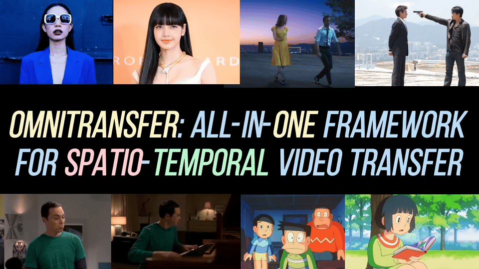

<div align="center">
<h1> OmniTransfer: All-in-one Framework for Spatio-temporal Video Transfer </h1>

<a href="https://arxiv.org/"></a>
<a href="https://pangzecheung.github.io/OmniTransfer/"></a>

[Pengze Zhang](https://pangzecheung.github.io/Homepage/), [Yanze Wu](https://tothebeginning.github.io/)<sup> * </sup>, [Mengtian Li](https://scholar.google.com/citations?user=y8OBcb8AAAAJ), [Xu Bai](https://openreview.net/profile?id=~Baixu1), [Songtao Zhao](https://openreview.net/profile?id=~Songtao_Zhao1)<sup>&dagger; </sup>, <br>[Fulong Ye](https://scholar.google.com/citations?user=-BbQ5VgAAAAJ&hl=en), [Chong Mou](https://scholar.google.com/citations?user=SYQoDk0AAAAJ&hl=zh-CN), [Xinghui Li](https://crayon-shinchan.github.io/xinghui99.github.io/), [Zhuowei Chen](https://scholar.google.com/citations?user=ow1jGJkAAAAJ), [Qian He](https://scholar.google.com/citations?user=9rWWCgUAAAAJ), [Mingyuan Gao](https://openreview.net/profile?id=~Mingyuan_Gao2)<br>
<sup> * </sup>Corresponding author, <sup> &dagger; </sup>Project leader 

<!-- Intelligent Creation Lab, ByteDance -->

</div>
<div align=center>

<br>
<em>Built upon Wan 2.1, OmniTransfer seamlessly unifies spatial appearance (ID and style) and temporal video transfer tasks (effect, motion and camera movement) within a single framework, and exhibits strong generalization across unseen task combinations.</em>
</div>


## 📃 Abstract
Videos convey richer information than images or text, capturing both spatial and temporal dynamics. However, most existing video customization methods rely on reference images or task-specific temporal priors, failing to fully exploit the rich spatio-temporal information inherent in videos, thereby limiting flexibility and generalization in video generation. To address these limitations, we propose **OmniTransfer**, a unified framework for spatio-temporal video transfer. It leverages multi-view information across frames to enhance appearance consistency and exploits temporal cues to enable fine-grained temporal control. To unify various video transfer tasks, OmniTransfer incorporates three key designs: Task-aware Positional Bias that adaptively leverages reference video information to improve temporal alignment or appearance consistency; Reference-decoupled Causal Learning separating reference and target branches to enable precise reference transfer while improving efficiency; and Task-adaptive Multimodal Alignment using multimodal semantic guidance to dynamically distinguish and tackle different tasks. Extensive experiments show that OmniTransfer outperforms existing methods in **appearance** (**ID** and **style**) and **temporal** transfer (**camera movement** and **video effects**), while matching pose-guided methods in **motion** transfer without using pose, establishing a new paradigm for flexible, high-fidelity video generation.

<!-- <p align="center">

<p> -->


## 🔥 Latest News

* Jan 7, 2026: We release the [Project Page](https://pangzecheung.github.io/OmniTransfer/) of **OmniTransfer**.
<!-- and [Technique Report](https://arxiv.org)   -->

## 🎬 Show Case


### Effect Video Transfer
**Zero-Shot Prompt-Free VFX Mastery:** Replicate intricate visual effects from unseen videos directly onto your images with seamless temporal consistency.
<div align=center>

</div>
<br>

### Motion Video Transfer
**Pose-Free Animation:** Driven static images by directly injecting fluid, complex motion from unseen sources without explicit pose extraction.
<div align=center>

</div>
<br>

### Camera Video Transfer
**Trajectory-Free Camera Control:** Mirror master-class cinematography from unseen clips onto static landscapes without explicit trajectory or parameter estimation.
<div align=center>

</div>
<br>

### ID Video Transfer
**Dynamic Identity Anchoring:** Synthesize consistent personas by distilling cross-temporal and multi-angle ID cues from reference videos.
<div align=center>

</div>
<br>

### Style Video Transfer
**Temporal-Style Distillation:** Generate consistent stylized videos by inheriting cross-frame aesthetic cues from reference clips.
<div align=center>

</div>
<br>

### X Transfer
**Beyond Observed Boundaries:** OmniTransfer generalizes to unprecedented scenarios from multi-person motion synchronization to unseen task combinations.
<div align=center>

</div>
<br>

### OmniTransfer with Seedance 1.0
**OmniTransfer** supports **Seedance 1.0**, enabling the delivery of more intricate and high-impact visual effects.
<div align=center>

</div>

## ⭐ Citation

If OmniTransfer is helpful, please help to ⭐ the repo.

If you find this project useful for your research, please consider citing our [paper](https://arxiv.org/).

### BibTeX
```bibtex
@misc{zhang2026omnitransfer,
title={OmniTransfer: OmniTransfer: All-in-one Framework for Spatio-temporal Video Transfer}, 
author={Pengze Zhang, Yanze Wu, Mengtian Li, Xu Bai, Songtao Zhao, Fulong Ye, Chong Mou, Xinghui Li, Zhuowei Chen, Qian He and Mingyuan Gao},
year={2026},
eprint={XXXX.XXXX},
archivePrefix={arXiv},
primaryClass={cs.CV},
url={https://arxiv.org/abs/XXXX.XXXX}, 
}
```

## ❤️ Acknowledgement
We would like to thank Junjie Luo, Pengqi Tu, Qi Chen, Qichao Sun and Wanquan Feng for their insightful discussions and valuable data contributions.

## 📧 Contact
If you have any comments or questions regarding this open-source project, please open a new issue or contact us.
